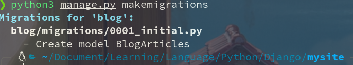
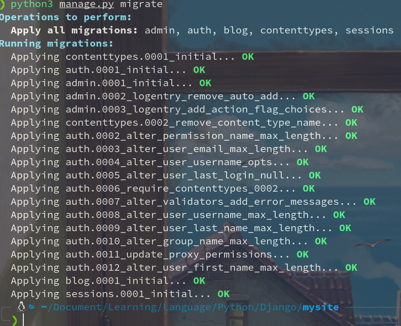

```
 ____  _                         
|  _ \(_) __ _ _ __   __ _  ___  
| | | | |/ _` | '_ \ / _` |/ _ \ 
| |_| | | (_| | | | | (_| | (_) |
|____// |\__,_|_| |_|\__, |\___/ 
    |__/             |___/       
```


# Django学习笔记

## Chapter 1： 简单的博客系统


**"Django makes it easier to build better Web apps more quickly and with less code"** 

 **书名:  《跟老齐学python：Django实战》**
	
> 项目：多用户内容发布系统

### 1.1 Django起步

#### 1.1.2 Django安装
> $pip3 install Django

**you can check the django env**   

```python
$ python3
>> import django
>> print(django.get_version()) #打印django的版本号
```
#### 1.1.3 创建项目
1. **django-admin startproject mysite**  

2. **django-admin startproject mysite .**  


#### 1.1.3 运行项目
`python3 manage.py runserver`  

   

 

 

#### 1.1.4 创建应用
`python3 manage.py startapp blog`

#### 1.1.5 添加项目到setting.py配置中
  

#### 1.1.6 知识点
1. 开发模式
> - 及系统尚处于开发阶段，还没有正式对外部客户提供服务.比如在开发模式中, 不需要配置Apache或着Nginx等服务器，也能够运行网站，但转换为生产模式后需要配置  
> - 在开发模式中，Django会自动检测到修改的代码并重新加载，不需要每次修改后重新启动Web服务器。只有在新增加文件后，才需要重启Django服务  
> - 运行Django服务的指令是 python manage.py runserver  

2. 项目和应用
> - Django安装后则可以用:<u>**django-admin startproject projectname**</u> 来创建一个Django项目
> - 创建应用使用<u>**python manage.py startapp appname**</u> 或者 <u>**django-admin startapp appname**</u>
> - 每个应用都要在项目的setting.py文件的<u>**INSTALLED_APPS**</u>中进行声明  

3. 文档导读
> - [Writing your Django app](https://docs.djangoproject.com/en/2.1/intro/tutorial01/) 
> - [使用Django的网站](https://djangosites.org/) 
> - [Django FAQ](https://docs.djangoproject.com/en/2.1/faq/)   

--------  

### 1.2  编写博客的数据模型类
- **设计数据库和表结构是做网站的基础，在Django中我们完全用Python的方式创建数据模型**   

#### 1.2.1 数据模型类
- **利用Django开发网站系统，在一般情况下，要先编写数据模型，比如在 <u>./blog/models.py</u>中写一个类，这个类与数据库中的数据表具有对应关系**  

- **接下来创建BlogArticles** 
> - 通过这个数据模型类，可以创建数据库中的一个专门用来保存博客文章的数据库表
> - Django中的数据模型类都继承django.db.models.Model类  
>
>" height="<500>"> 
>
>> -  字段**title**的属性为CharField()类型,字段的最大值为300
>> - 字段**author**规定了博客文章和用户之间的关系;一个用户对应多个文章，<u>**[FroeignKey()](https://docs.djangoproject.com/en/2.1/ref/models/fields/#django.db.models.ForeignKey)**</u>就是反应了一对多的关系
>> -**on_delete**这是必不可少的，其值通常为models.CASCADE, 含义是“级联删除”.比如删除用户，其的文章也会删除
>> -**related_name="blog_posts"**其作用是允许类User的实例
>> -**ordering=("-publish, ")** 规定了BlogArticles实例对象的显示顺序，及按照publish字段值的倒序显示  
  
- **根据数据模型建立数据库表**  
>> - 执行`python3 manage.pymakemigrations`  
>>    
>>    
>> - 提示信息告诉我们在blog/migrations目录中创建了一个BlogArticles模型  
>>    
>>> 这是由Django自动生成的  
>> - 可执行`python3 manage.py sqlmigrate blog 0001`  
>>     
- 这个表的名称由两部分组成  
>> 1. blog是本应用名称的小写  
>> 2. blograticles是在models.py中创建的数据模型类的名称小写  
>> - 上面创建了一个能够建立数据库表的文件   
>> - 接着创建数据库  
>>> `python3 manage.py migrate`  
>>>     
  
- 本书中的项目使用SQLite数据库, 并且在setting.py中规定了数据库文件的存放在项目的根目录中  
>>   
>> - sqlite3 ./db.sqlite3  
>> - .tables  
>> - 用SQLite查看下db.sqlite3文件   
>>   
>> - sqlite查看当前的模型数据  
>>     

  

#### 1.2.2 发布博客文章
- **我们先使用Django默认的管理功能发布文章，这是最简单的。** 
>>
> - 创建管理员
>> `python manage.py createsuperuser`  
>>> 创建一个superuser
>> - 之后可以runserver了，查看http://localhost:8000/admin/则进入登录页面
>>>   
>> - 登录后的默认页面  
>>>  
>> - 给其添加blog功能,编辑 /blog/admin.py文件   
>>   
>>> - 刷新网页后如图  
>>>   
>> - 添加文章   
>>>    
>> - 保存文章   
>>>   

**可进入数据库查看有无添加** 
```
$ sqlite3 ./db.lite3   #进入项目根目录
$ .tables								#查看当前数据库
$ .header on						#对其表头
$ .mode column				  #对齐纵列
$ select * from blog_blogarticles;				#打开数据库
```
>>    
>> - 让列表更丰富继续编辑admin.py  
>>     
>>>    
>>> - URL     

#### 1.2.3 知识点  

1. **什么是HTTP**  
> - HTTP: Hyper Text Transfer Protocol(超文本传输协议)
>> -HTTP/1.1协议共定义了8种请求方式分别是OPTIONS、HEAD 、GET、POST、PUT、DELETE、TRACE和CONNECT
> - HTTPS:Hyper Text Protocol Secure
>> - http的默认端口是80, https的默认端口是443
2. **什么是URL** 
> - URL: Uniform / Universal Resource Locator(统一资源定位符)
>> - URL的标准格式是：协议类型：//服务器地址（必要时需加上端口号）/路径/文件名
>>> - 协议： HTTP or HTTPS
>>> - 服务器定制：IP地址或域名
>>> - 路径：以“/”区别目录。对GET请求可以用“？”发起参数，每个参数用“&”隔开，再以“=”分开参数名称与值
>>> - 文件名：可写可不写
>> - 修改本地域名:
>>> - Linux: /etc/hosts
>>> - Windows: /system32/drivers/etc/host
3. **模型：ORM** 
> - ORM: Object-Relational Mapping(对象关系映射)
>> - 其作用是在关系型数据库和业务实体对象之间进行映射，这样在操作业务对象时，就不需要再去和复杂的SQL语句打交道，只需简单地操作对象的属性和方法。
>> - ORM 提供一个自动引用和转义输入变量的机制，开发者可以将精力集中在程序的业务逻辑和开发上
>>> - Django的ORM表现方式就是编写数据模型类，这些类可以写到任何文件中，通常写到每个应用的models.py文件。每个数据模型类都是django.db.models.Model的子类。应用的名称和数据模型类的名称共同组成一个数据库表的名称（“appname_modlename”）
>>>> - 在数据模型类写好后，通过执行Django的数据迁移操作  
>>>> `python manage.py makemigrations`  
>>>> `python manage.py migrate`   
>>>> 就能够创建相应的数据库表，用来保存网站项目的数据。   

4. **文档导读**
> 1. [Object-relational mapping](https://en.wikipedia.org/wiki/Object-relational_mapping)   
> 2. [What is an ORM and Where can I learn more about it](https://stackoverflow.com/questions/1279613/what-is-an-orm-and-where-can-i-learn-more-about-it)   

### 1.3 **显示博客信息** 

#### 1.3.1 **显示文章标题** 

1. **要显示文章标题，就要把标题从数据库中读出来**  
> - 1. 通过SQL语句进行读取  
> - 2. 通过Django进行读取  
> - 我们在/blog/models.py中创建类数据模型后，Django就会自动提供数据库抽象的API，通过这个API可以进行创建、获取、修改和删除对象，此称ORM  
>>   
>>> 通过`python3 manage.py shell`的方式进入交互模式中，就将Django环境引入当前交互模式中   
>>   
>>> -创建了类的实例来查看   
>> - 对BlogArticles类进行类似操作  
>>>    
>>> - 对于上述的查询操作被称为QuerySet   
2. **编写一个函数，专门用来读取文章标题**   
> - 这个函数通常被写在/blog/views.py文件中
>>   
>>> - blog_title()这种被称为基于函数的视图,还有一种是基于类的视图   
>>> render()中出现的blog/titles.html就是展示标题列表的前端页面-被称模版。在每一个应用中都可以有一个专门的模版目录，目录名称必须为templates    
>>>>     
>>>> - templates 目录是Django默认的存放本应用所需模版的目录，它会在运行时自动来这里查找render()函数所指定的模版位置   
>> -编写模版base.html文件, 这个文件是将所有模版中公共的部分抽取出来，在其它文件中只需要编写个性部分的代码。  
>>> base.html的代码如下：  
>>>    
>> - 接着编写/templates/blog/titles.html文件   
>>> 代码如下：  
>>>    
>> - 要通过网页访问需要配置URL文件, 首先配置/mysite/urls.py, 在这个文件中配置本项目的各个应用    
>>>    
>>> - 通过这里的URL配置，将请求转向blog应用的urls.py  
>>>> - 后续项目中, 都是在/mysite/urls.py中配置应用URL后，再到某个应用的urls.py文件中配置该应用的具体URL   
>>> - 配置/blog/urls.py：
>>>>    
>>>> - path()第一个参数为空，表示访问根，有因在blog应用中，所以访问blog应用的根,    
>> - 效果如下：
>>>    

#### 1.3.2 查看文章内容


--------


--------

## 总结

| 文件        | 意思作用                                                                                                                                   |
|-------------|--------------------------------------------------------------------------------------------------------------------------------------------|
| __init__.py | 项目的初始化包                                                                                                                             |
| settings.py | 这个文件中包括了项目的初始化设置，可以针对整个项目进行有关参数配置，比如配置数据库、添加应用等                                             |
| urls.py     | 这是一个URL配置表文件.此URL配置文件，主要将URL映射到应用程序上                                                                             |
| wsgi.py     | WSGI是Web Server Gateway Interface.是python所选择的服务器和应用标准，定义了我们所创建的项目是WSGI应用                                      |
| __pycache__ | 只有runserver后才有，是一个编译后的文件夹                                                                                                  |
| admin.py    | 在这个文件中，可以自定义Django管理工具，比如设置在管理界面能过管理的项目，或者通过重新自定义与系统管理有关的类对象，向管理功能增加新的内容 |
| apps.py     | 包含对应用的配置，比如为管理功能提供一个合适的应用名称                                                                                     |
| migrations  | 这是一个目录，用于存储应用的数据库表结构的指令，通过这些指令可以修改和创建数据库，从而在models.py模型类和数据库表之间迁移                  |
| models.py   | 这是应用的数据模型，每个Django应用都应当有一个models.py文件，虽然该文件可以为空，但不宜删除                                                |
| tests.py    | 在这个文件中可以编写测试文档来测试所建立的应用                                                                                             |
| views.py    | 这是一个重要的文件，用于保存响应各种请求的函数或者类，称基于函数或类的视图,views.py就是保存函数或着类的视图文件                            |
| db.sqlite3  | 这是一个默认的数据库。SQLite是python默认安装的数据库                                                                                       |


**manage.py**
> - * 在创建一个Django项目后，manage.py在项目的根目录中被动生成，它是对django-admin.py的简单封装，同样能够实现命令行操作
> - 与django-admin进行对比，两者内容大体相同
> > - admin命令对应django-admin.py文件，保存在django安装目录的/bin下面
> > - manage.py只在建立一个项目后，才存在于项目的根目录中
 
**settings.py** 
> **DEBUG:**  其值为True或False。在开发过程中需设置称True，在调试时能显示详细的报错信息——这是开发模式, 如果将项目部署到真正对外发布的服务器上，我们称为“生产环境”, 则改为False,从而避免暴露项目的内部信息  
> - **ALLOWED_HOSTS:**  在DEBUG为True时，其值可为空。当部署到生产环境中时，要把主域名填写到这里，才能通过域名访问到本网站
> - **INSTALLED_APPS:** 这是重要的配置项，所以应用只有写到这里才能生效。在默认情况下已有一些应用，比如django.contrib.admin就是针对项目后台管理的应用。
> - **DATABARER:** 在这里可以配置数据库，django支持常见的MySQL、PostgreSQL、Oracle等。默认配置SQLite
> - **LANGUAGE_CODE:** 设置项目的语言，在一般情况下可以不用修改，如果非用汉语，则设置为 LANGUAGE_CODE = 'zh-hans'
> - **TIME_ZONE:** 设置时区，通常使用东八区，设置为"Asia/Shanghai"
>>   


| 命令                        | 作用                         |
|-----------------------------|------------------------------|
| python3 manage.py runserver | 运行项目                     |
| django-admin                | 是django的任务管理命令行工具 |


